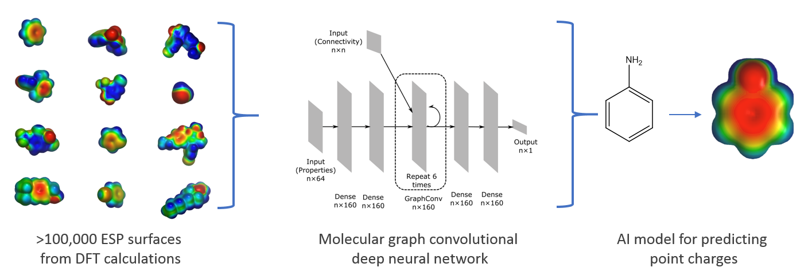

# ESP-DNN: A Graph-Convolutional Deep Neural Network for predicting electrostatic potential surfaces
<div align="center"></div>
<br>This repository contains the trained models and code for generating [PQR files](https://apbs-pdb2pqr.readthedocs.io/en/latest/formats/pqr.html)
for ligands and proteins that allow creating near-DFT-quality molecular ESP surfaces.
The PQR files generated by our models contain charges on atoms
as well as off-centred charges on atomic features (e.g., lone pairs, sigma holes, p orbitals).

For generating ligand PQR files, a graph convolutional deep neural network (DNN)
model, trained on ESP surfaces derived using DFT calculations for ~100,000
molecules, is used. For proteins, parametrized charges for amino acids are
used, which are fully compatible with the ligand ESP surfaces generated using
the DNN model.
See [this publication](TOADD) for more details.

# System requirements
This program will run only on 64 bit linux operating systems.

# How to install
To run ESP-DNN, you need to:
* Clone this repository
* setup Python and third-party dependencies.
* (optionally) install this package.

## Cloning this repository
See "Clone" button on this page for further information

## Setting up Python and third-party dependencies
Our package has been developed and test using Python 2.7 and the following
versions of the third-party packages:
* rdkit==2018.09.3
* keras==2.2.4
* tensorflow==1.10.0
* numpy==1.16.2

We recommend using [Anaconda Python distribution](https://www.anaconda.com/distribution/)
for installing Python and the dependencies. Clone this repository and run the
following commands:

```
conda env create -f environment.yml
source activate esp-dnn-env
```

## (Optionally) installing this package
If you want to be able to run this program from any directory, you need to
install this package. Otherwise, you should be able to run this package from the
parent directory where you cloned this package. For example, if you cloned this
repository in ```/home/username``` directory, then you need to
```cd /home/username``` before running the program.

For installing the package, run the following commands.
```bash
conda activate esp-dnn-env
cd {THIS_REPOSITORY}
python setup.py
```
Note that the {THIS_REPOSITORY} for the above command will be ```/home/username/esp-dnn```

# Example runs
Note: You need to be running the following commands from the parent directory
of this package if you have not installed this package.

To see the help on how to run the program run:
```bash
python -m ESPAI.predict -h
```

This package contains example ligand and protein PDB files in the ```example```
directory. The output PQR files for each ligand and protein are also provided
in the same directory for comparison.

### Running prediction on ligand files:
```bash
python -m ESPAI.predict -m ligand -i {THIS_REPOSITORY}/examples/ligands
```

### Running prediction on protein files:
```bash
python -m ESPAI.predict -m protein -i {THIS_REPOSITORY}/examples/proteins
```

Compare the PQR files generated using the above commands with the corresponding
*.saved files in the ```example``` directory.

# Visualizing ESP surfaces
We recommend using [NGL viewer](http://nglviewer.org/ngl/)
* Open the PQR file using the File menu
* Add a surface representation using the three line menu icon on the side bar
  on the right
* On the surface menu, set:
    * surfaceType = av
    * radiusType = explicit
    * colorScheme = electrostatic

# Authors
* Prakash Chandra Rathi
* R. Frederick Ludlow
* Marcel L. Verdonk
<p>
<br>Astex Pharmaceuticals,
<br>436 Cambridge Science Park
<br>Milton Road
<br>Cambridge CB4 0QA
<br>United Kingdom
<\p>

# Acknowledgements
This work was funded by a postdoctoral fellowship awarded to PCR under the “Sustaining Innovation Postdoctoral Training Program” at Astex Pharmaceuticals. We would like to thank Andreas Bender and Richard Lewis of the Chemistry Department at Cambridge University for getting us started with model training and helpful discussions. We thank the members of the computational chemistry and informatics department for helpful discussions. In particular we thank Gianni Chessari for discussions around XIAP SAR, Paul Mortenson for assisting us setting up Q-chem calculations, and Chris Murray and Richard Hall for useful feedback and for reading the manuscript.

# Contact
For any suggestions, comments, issues, please contact us using "pli-at-astx-dot-com"