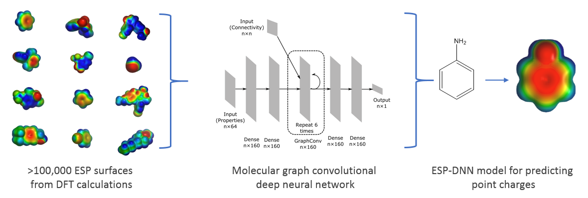

# ESP-DNN: Graph-convolutional DNN for predicting electrostatic potential surfaces

This repository contains the trained models and code for generating [PQR files](https://apbs-pdb2pqr.readthedocs.io/en/latest/formats/pqr.html)
for ligands and proteins that allow creating DFT-quality molecular ESP surfaces.
The PQR files record partial charges and radii for each atom in the PDB
occupancy and b-factor columns, respecyively. PQR files generated by our model
contain charges on atoms as well as off-centred charges on atomic features
(e.g., lone pairs, sigma holes, p orbitals).

For generating ligand PQR files, a graph convolutional deep neural network (DNN)
model, trained on ESP surfaces derived using DFT calculations for ~100,000
molecules, is used. For proteins, parametrized charges for all amino acids are
used, which are fully compatible with the ligand ESP surfaces generated using
the DNN model.


# How to install
To run ESP-DNN, you need to:
* Clone this repository
* setup Python and third-party dependencies.
* (optionally) install this package.
* Install and setup [PLI code](https://bitbucket.org/AstexUK/pli/src/pli-snapshot/)

## Cloning this repository
See Clone button on this page for further information

## Setting up Python and third-party dependencies:
Our package has been developed and test on Python 2.7 and the following
third-party packages:
* rdkit==2018.09.3
* keras==2.2.4
* tensorflow==1.10.0
* numpy==1.16.2

We recommend using [Anaconda Python distribution](https://www.anaconda.com/distribution/)
for installing Python and the dependencies. Clone this repository and run the
following commands:

```
conda env create -f environment.yml
source activate esp-dnn-env
```

## (Optionally) installing this package
If you want to be able to run this package from any directory, you need to
install this package. Otherwise, you should be able to run this package from the
parent directory where you cloned this package. For example, if you cloned this
repository in ```/home/username``` directory, then you need to
```cd /home/username``` before running the program.

For installing the package, run the following commands.
```bash
conda activate esp-dnn
cd {REPOSITORY_DIRECTORY}
python setup.py
```
None {REPOSITORY_DIRECTORY} for the above command will be ```/home/username/esp-dnn```.

## Installing PLI code
```bash
git clone xxx.git
cd PLI
make pli
```

## Set up PLI_DIR environment variable
You need set PLI_DIR environment variable with the top level directory of
the PLI repository just cloned 
### on csh
```csh
setenv PLI_DIR {PLI_DIR}
```
### on bash
```bash
export PLI_DIR={PLI_DIR}
```
Note: replace {PLI_DIR} with the directory you cloned PLI repository into.


# Example runs
Note: You need to be running the following commands from the parent directory
where this repository has been cloned unless you have installed the this
package.

To see the help on how to run the program run:
```bash
python -m ESPAI.predict -h
```

This package contains example ligand and protein PDB files in the ```example```
directory. The output PQR files for each ligand and protein are also provided
in the same directory for comparison.

### Running prediction on ligand files:
```bash
python -m ESPAI.predict -m ligand -i examples/ligands
```

### Running prediction on protein files:
```bash
python -m ESPAI.predict -m protein -i examples/proteins
```

Compare the PQR files generated using the above commands with the corresponding
*.saved files in the ```example``` directory.

# Visualizing ESP surfaces
We recommend using [NGL viewer](http://nglviewer.org/ngl/)
* Open the PQR file using the File menu
* Add a surface representation using the three line menu icon on the side bar
  on the right
* On the surface menu, set:
    * surfaceType = av
    * radiusType = explicit
    * colorScheme = electrostatic

# Contact
For any suggestions, comments, issues, please contact [this email](mailto://pli@astx.com).
